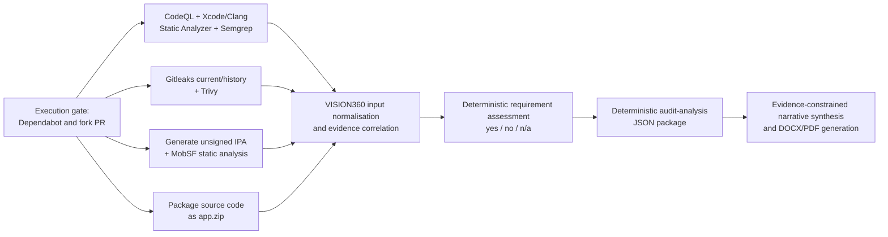

# i-mSEC-AT - iOS Application Security Auditing Toolkit


> Scan, correlate, and generate AI-assisted security reports for iOS applications in a single pipeline.

**i-mSEC-AT** is an automated DevSecOps toolkit for auditing iOS applications from source code, Git history, compiled IPA files, and dependency metadata. It combines native Apple analysis, security scanners, evidence correlation, a catalogue of 462 iOS requirements, and structured report generation.

## Overview

i-mSEC-AT brings several complementary forms of analysis into one reproducible workflow:

- Static application security testing with CodeQL, Xcode/Clang Static Analyzer, and Semgrep.
- Secret exposure analysis in the current source tree and complete Git history with Gitleaks.
- Static IPA inspection with MobSF.
- Dependency vulnerability scanning with Trivy.
- iOS-specific evidence extraction and correlation with VISION360.
- Deterministic requirement evaluation followed by AI-assisted narrative synthesis and generation of Excel, DOCX, and PDF deliverables.

The objective is to reduce manual collection and normalization work while retaining traceable evidence for professional review. Automated results are not a substitute for expert validation or an application-security certification.

### Deterministic assessment and AI-assisted reporting

The assessment and reporting stages:

- Deterministically correlate findings from multiple tools instead of presenting isolated scanner outputs.
- Deterministically evaluate evidence against the bundled iOS security-requirements catalogue.
- Generate structured JSON and an auditable Excel assessment.
- Produce a human-readable audit summary in DOCX and PDF, with optional AI-assisted narrative synthesis.
- Assign `n/a` when functionality is absent or an essential verification capability is unavailable; an applicable and technically assessable requirement with insufficient supporting evidence receives `no/insufficient_evidence`.

The LLM is restricted to controlled linguistic operations with structured inputs and validated outputs: conditional translation, optional wording of precomputed requirement justifications, and audit-summary narrative synthesis. It cannot modify requirement outcomes, determination bases, evidence mappings, counts, or metrics. A private OpenAI-compatible endpoint can keep source-derived evidence within an organization. Deterministic fallbacks permit assessment and report generation when optional LLM-assisted functions are not configured.

## Why i-mSEC-AT?

- A single pipeline covers Swift, Objective-C, Objective-C++, the built IPA, dependencies, and repository history.
- Native Xcode build and analysis are executed on GitHub-hosted macOS runners.
- Scanner findings are normalized into machine-readable evidence and merged SARIF.
- Secret values and contributor identity data are removed before Gitleaks evidence reaches artifacts or reports.
- The catalogue is designed directly for iOS and uses Apple security mechanisms and terminology.
- SECM-CAT-iOS contains 462 requirements developed through a new systematic review of 742 Scopus records, complementary regulatory and security sources, and official Apple security documentation.
- After duplicate removal and four screening stages, 16 primary studies were included.
- The workflow can be copied into an existing iOS application repository without imposing a specific signing strategy.
- Intermediate artifacts remain available for traceability, independent review, and research reproducibility.

## Catalogue artefacts

- **SECM-CAT-iOS** is the reusable SRS containing the 462 traceable security requirements used to define assessment criteria and correlate evidence.
- **SECM-CAT-iOS\*** is the application-, revision-, and audit-profile-specific instance. The pipeline determines contextual applicability and records `yes`, `no`, or `n/a`; requirements needing capabilities excluded from the selected profile are explicitly identified before evidence is interpreted.


## Analysis coverage

- **CodeQL Swift:** extended security queries over an instrumented `xcodebuild` compilation.
- **Xcode/Clang Static Analyzer:** Objective-C, Objective-C++, C, and C++ analysis through `xcodebuild analyze`; execution is verified and `.xcresult` findings are converted to SARIF. Swift remains covered by CodeQL, Semgrep, compiler diagnostics, and VISION360.
- **Semgrep:** Swift, general security-audit, secret-detection, and local Objective-C rules covering weak hashes, unsafe Keychain accessibility, unsafe C string operations, and disabled TLS validation.
- **Gitleaks:** separate scans of the current source tree and full Git history, producing redacted SARIF and current/history-only counts.
- **MobSF:** static inspection of the unsigned per-commit IPA, including permissions, privacy configuration, ATS, binaries, frameworks, and code findings. Production-signing, provisioning, and effective-entitlement checks remain outside the pipeline profile.
- **Trivy:** known vulnerabilities in supported dependency manifests and lockfiles.
- **VISION360:** iOS fingerprinting across Swift and Objective-C source, `Info.plist`, entitlements, `.xcconfig`, Xcode projects, Keychain, biometrics, ATS, TLS, WKWebView, cryptography, runtime loading, permissions, jailbreak indicators, and scanner evidence.

Secret values, commit identifiers, and author names or email addresses detected by Gitleaks are excluded from uploaded artifacts, VISION360, and final reports. A historical finding indicates prior exposure, not that a credential remains active; affected credentials should nevertheless be reviewed and rotated or revoked where appropriate.

## How it works

The orchestrator starts four analysis branches in parallel and then runs the correlation and reporting stages serially:

1. CodeQL build, Xcode/Clang analysis, Semgrep, and SARIF generation.
2. Gitleaks current/history scanning and Trivy dependency analysis.
3. Unsigned per-commit IPA build followed by MobSF static analysis.
4. Source-code packaging for iOS fingerprinting.
5. VISION360 input normalization and evidence correlation.
6. Evaluation of the 462 iOS security requirements.
7. Audit-summary generation and PDF conversion.



## Requirements

- An iOS repository containing an `.xcodeproj` or `.xcworkspace` and a shared scheme.
- A project that can build non-interactively with `xcodebuild` on macOS.
- GitHub Actions access to a `macos-15` runner for Xcode and CodeQL Swift.
- A MobSF instance reachable from the runner and its API key.
- An iOS project that can produce an unsigned device build for static analysis.
- Python 3.11 in the reporting jobs; GitHub Actions configures it automatically.
- Optionally, an OpenAI-compatible LLM endpoint for conditional translation and evidence-constrained narrative synthesis. Deterministic assessment and reporting fallbacks do not require an LLM endpoint.

### Supported host environments

- **GitHub-hosted macOS:** required for Xcode, Swift CodeQL capture, Clang analysis, and IPA building.
- **GitHub-hosted Ubuntu:** used for Gitleaks, Trivy, VISION360 normalization, requirement evaluation, and report generation.
- **Developer workstations:** macOS with a compatible Xcode version is recommended for reproducing iOS builds locally. Windows can validate the Python processing code but cannot execute Xcode analysis.

## Quick start

1. Copy `.github/` and `scripts/` into the root of the iOS application repository.
2. Ensure the Xcode scheme is shared and committed.
3. Configure `IOS_XCODE_CONTAINER`, `IOS_SCHEME`, MobSF, and the required secrets.
4. Verify that `scripts/build_ios_ipa.sh` can build the project without code signing.
5. Run `.github/workflows/pipeline.yml` manually or push a change to `main`.
6. Download `audit-summary-zip` from the completed GitHub Actions run.

## Integration into an iOS project

The consuming repository should have a structure similar to:

```text
your-ios-project/
├── .github/
│   ├── codeql/
│   ├── semgrep/
│   └── workflows/
├── scripts/
├── MyApp.xcodeproj/ or MyApp.xcworkspace/
├── MyApp/
├── MyAppTests/
└── ...
```

### GitHub variables

| Variable | Purpose | Example |
|---|---|---|
| `IOS_XCODE_CONTAINER` | Workspace or project used by `xcodebuild` | `MyApp.xcworkspace` |
| `IOS_SCHEME` | Shared app scheme | `MyApp` |
| `IOS_DESTINATION` | Destination used for SAST builds | `generic/platform=iOS Simulator` |
| `IOS_SETUP_CMD` | Optional command that prepares or generates the Xcode project before builds | `make setup` |
| `IOS_RUBY_VERSION` | Optional exact Ruby version required by project setup tooling | `4.0.3` |
| `IOS_RUNNER_IMAGE` | Optional GitHub-hosted macOS image selected for Xcode and IPA builds | `macos-26` |
| `ENABLE_CODE_SCANNING_UPLOAD` | Upload CodeQL SARIF to GitHub Code Scanning | `true` |
| `MOBSF_BASE_URL` | Reachable MobSF base URL | `https://mobsf.example.internal` |
| `LLM_BASE_URL` | Base URL of the OpenAI-compatible API | `https://api.openai.com/v1` |
| `LLM_MODEL` | Model identifier exposed by the selected endpoint | Environment-specific |

### GitHub secrets

| Secret | Purpose |
|---|---|
| `MOBSF_API_KEY` | Authenticate requests to the MobSF REST API |
| `LLM_API_KEY` | Authenticate narrative-synthesis and report-generation requests |

Configure them under:

```text
Repository → Settings → Secrets and variables → Actions
```

### Xcode container and scheme

The workflow can discover the first Xcode container, but `IOS_XCODE_CONTAINER` and `IOS_SCHEME` should be set explicitly for reproducible results, especially when a repository contains multiple apps or schemes. The selected scheme must be shared and committed under `xcshareddata/xcschemes`.

Projects that require a preparation step can set `IOS_SETUP_CMD`, for example to `make setup`, `tuist generate`, `xcodegen generate`, or `bundle exec pod install`. If that setup requires an exact Ruby release, set `IOS_RUBY_VERSION`; the selected Ruby is installed before the setup command without running Bundler automatically. Projects requiring a newer Xcode toolchain can select its hosted runner through `IOS_RUNNER_IMAGE`; when unset, both build jobs retain the `macos-15` default. The setup command runs in a non-login shell so the tool paths established by setup actions, including the selected Ruby, are preserved. It runs before Xcode project discovery in the CodeQL/Clang job and before the MobSF IPA build because those jobs use separate macOS runners. Treat `IOS_SETUP_CMD` as trusted configuration because its value is executed as a shell command; do not derive it from pull-request content.

### Unsigned IPA generation

The pipeline always invokes `scripts/build_ios_ipa.sh` to generate `build/mobsf/App.ipa` from the revision being audited. The helper creates an unsigned device IPA suitable for MobSF static analysis; it cannot be installed or distributed. Supplying or selecting a precompiled IPA is not supported, which prevents the audit from accidentally inspecting an artifact produced from a different revision.

The unsigned mode is the recommended default for continuous analysis on every commit. It does not require an Apple Developer account, signing certificates, private keys, provisioning profiles, or project-specific export configuration. This keeps the workflow reusable across repositories and avoids exposing distribution credentials to CI jobs, forks, or pull requests.

An unsigned IPA still supports source and binary static analysis, including CodeQL, Semgrep, Xcode/Clang analysis, Gitleaks, dependency scanning, ATS and `Info.plist` review, Keychain and cryptography usage, WKWebView checks, privacy manifests, insecure APIs, dynamic-code-loading indicators, and most MobSF static findings.

It cannot conclusively validate the identity or distribution properties of the final application. The following checks remain outside the default pipeline scope:

- Cryptographic validity of the application signature and identity of the signer.
- Distribution certificate type, algorithm, expiration, and trust chain.
- Embedded provisioning-profile validity and its relationship to the bundle identifier.
- Effective signed entitlements, including `get-task-allow`, App Groups, Keychain Access Groups, Associated Domains, and push capabilities.
- Differences between the CI build and the final App Store, Ad Hoc, or Enterprise artifact.
- Installation and runtime behavior on a supported physical or virtual iOS device.
- MobSF dynamic-analysis observations such as runtime storage, network behavior, inter-process interaction, and behavior under instrumentation.

Requirements containing an essential verification obligation that depends on an unavailable capability are reported as `n/a`, rather than being inferred as compliant or non-compliant. In the default automated profile, this includes production-signing evidence, dynamic iOS execution, backend or server-side evidence, organizational documentation, and manual verification not represented by the collected artifacts. This also applies to compound requirements when only their static portion can be evaluated.

The generated workbook preserves the three primary outcomes (`yes`, `no`, and `n/a`) and includes explicit `Determination basis` and `N/A reason` columns. The basis distinguishes supporting evidence, evidenced non-compliance, insufficient evidence, unavailable essential capability, and absent functionality. The final Audit Summary reports the corresponding scope counts. Counts may overlap for compound requirements that require multiple unavailable capabilities.

The report distinguishes the evidence-supported compliance rate (`yes / applicable`) from conclusive evidential determination coverage (`(yes + evidenced no) / applicable`). Conservative `no` determinations are included among applicable requirements but not among conclusive evidential determinations, because they indicate that compliance was not demonstrated rather than confirming that the control is absent.

The evaluator applies the following safeguards before assigning an outcome:

- Functional applicability is checked before technical assessability, and technical assessability before supporting or contradictory evidence.
- Adverse-condition flags (for example, hardcoded credentials, insecure dynamic loading, file sharing, error disclosure, log injection, and memory-safety findings) explicitly expect `NO`; their polarity is not inferred only from requirement wording.
- A non-detection supports compliance only for checks whose static coverage is defined as conclusive. Otherwise it remains insufficient evidence or falls outside the profile.
- Certificate pinning is mandatory only for requirements that explicitly require certificate, public-key, TLS, or SSL pinning. Its absence does not by itself fail a general TLS or ATS requirement.
- Conditional components such as WKWebView are evaluated only when the corresponding functionality is present.
- For compound requirements, an unavailable essential capability takes precedence over partial supporting or contradictory evidence and produces `n/a`.

For the current 462-requirement catalogue and the default automated static, unsigned-IPA profile, the complementary metadata records the requirements whose essential verification depends on each unavailable capability:

- 36 requirements contain an essential verification obligation requiring dynamic iOS execution.
- 41 requirements contain an essential verification obligation requiring a production-signed IPA.
- 2 requirements depend on both capabilities.
- 147 requirements contain an essential obligation requiring backend or server-side evidence.
- 136 requirements contain an essential obligation requiring organizational evidence.
- 232 requirements contain an essential obligation requiring manual review beyond the automated artifacts.
- Because categories overlap for compound requirements, the union is 372 unique requirements that cannot receive a `yes` or `no` determination under the default automated profile and are therefore reported as `n/a`.

These figures describe capability-related exclusions only. The final `n/a` total may be higher for a particular application because functionality can be absent or a conditional scenario may not apply. Counts are regenerated whenever catalogue flags or capability mappings change.


### MobSF setup

Deploy MobSF using an installation method appropriate to your environment and follow its official documentation. The GitHub runner must be able to reach `MOBSF_BASE_URL` and authenticate with `MOBSF_API_KEY`.

The pipeline calls the MobSF upload, scan, and JSON-report endpoints for static IPA analysis. Dynamic iOS testing is not implemented by the proposed workflow and remains outside the predefined audit profile.

### LLM configuration and private deployment

i-mSEC-AT uses the OpenAI Python client as a communication layer but can use any compatible endpoint configured through `LLM_BASE_URL`, `LLM_MODEL`, and `LLM_API_KEY`.

```text
# Hosted endpoint
LLM_BASE_URL=https://api.openai.com/v1
LLM_MODEL=<model-name>

# Private or local compatible endpoint
LLM_BASE_URL=http://localhost:11434/v1
LLM_MODEL=<local-model-name>
```

A private endpoint can keep source-derived evidence and audit artifacts within organizational infrastructure. All runtime LLM instructions are version-controlled in `scripts/llm_prompts.yml` and loaded through `scripts/prompt_loader.py`; deterministic evidence collection and `yes`/`no`/`n/a` assessment rules remain in Python. The relevant pipeline outputs also include a JSON provenance artifact with the prompt-set version, versions of the prompts actually invoked, catalogue SHA-256 hash, and configured model. The methodological prompt documentation remains available under `resources/prompts/`.

### Report metadata

Edit `scripts/audit_summary_literals.json` before execution to customize the report cover, header, application metadata, auditor, requirements-engineering team, and engineering group.

```json
{
  "app_metadata": {
    "Name": "Example iOS App",
    "Developer": "Example Organization",
    "Category": "Mobile application",
    "Supported platforms": "iOS and iPadOS",
    "Version": "1.0.0",
    "Last update": "2026-08-18",
    "Compatible idioms": "iPhone and iPad",
    "Source": "Open source",
    "License": "MIT",
    "Main language": "Swift and Objective-C"
  },
  "actors": {
    "Auditor": "",
    "Requirement Engineering team": [""],
    "Engineering Group (EN)": [""]
  },
  "header_text": "Example iOS App Security Audit",
  "cover_page_text": "Example iOS App - Security Audit"
}
```

## Project structure

```text
i-mSEC-AT/
├── .github/
│   ├── codeql/                 # CodeQL query-suite configuration
│   ├── semgrep/                # Objective-C security rules
│   └── workflows/              # Reusable analysis and reporting workflows
├── resources/
│   ├── example-report/         # Representative DOCX and PDF report
│   └── prompts/                # LLM prompt documentation
├── scripts/
│   ├── requirements.json       # Authoritative catalogue of 462 iOS requirements
│   ├── llm_prompts.yml         # Versioned runtime LLM prompts and payload contracts
│   ├── prompt_loader.py         # Prompt validation, loading, and provenance
│   ├── ios_vision360_generator.py
│   ├── build_ios_ipa.sh
│   └── ...                     # Normalization, evaluation, and reporting
├── LICENSE
└── README.md
```

Only files invoked by the CI/CD workflows and their runtime data are kept in `scripts/`.

## Artifacts and output

- `app-zip`: source-code snapshot (`app.zip`) of the repository revision under assessment.
- `sast-xcode-components`: CodeQL and Xcode/Clang Analyzer outputs, including SARIF, Xcode `.xcresult`, JSON, and log data.
- `sast-semgrep-component`: Semgrep SARIF output for Swift and Objective-C source-code analysis.
- `sast-findings`: unified static-analysis findings combining CodeQL, Semgrep, Xcode/Clang Analyzer, and redacted Gitleaks SARIF evidence.
- `mobsf-report`: MobSF JSON results and IPA scan metadata.
- `trivy-payload`: Trivy dependency report, normalized payload, redacted Gitleaks SARIF, and aggregate secret-exposure summary.
- `vision360-bundle`: correlated iOS fingerprint and normalized evidence.
- `security-audit-excel`: requirement-level security assessment and requirement-prompt provenance.
- `audit-summary-analysis-pack`: deterministic structured audit-analysis JSON generated from the assessment checklist.
- `audit-summary-zip`: final audit report containing `Audit Summary.docx` and `Audit Summary.pdf`.

All outputs are published as GitHub Actions artifacts. Representative report files are available in:

- [Example audit summary - PDF](resources/example-report/i-mSEC-AT_example_auditSummary.pdf)
- [Example audit summary - DOCX](resources/example-report/i-mSEC-AT_example_auditSummary.docx)

## Reproducibility artifacts

The `resources/` directory provides supporting material:

- [LLM prompt documentation](resources/prompts/i-mSEC-AT_prompts.pdf)
- [Example audit summary - PDF](resources/example-report/i-mSEC-AT_example_auditSummary.pdf)
- [Example audit summary - DOCX](resources/example-report/i-mSEC-AT_example_auditSummary.docx)

The authoritative catalogue in `scripts/requirements.json` retains requirement-level source citations, validation criteria, and evidence-flag mappings used by the workflow.

## Use cases

- Continuous security auditing in iOS CI/CD pipelines.
- Pre-release assessment of Swift, Objective-C, and mixed applications.
- Evidence collection for mobile health and other regulated applications.
- Academic and industrial research in mobile application security.
- Evaluation of open-source iOS applications and third-party dependencies.
- Generation of structured evidence for expert review and remediation planning.

## Execution

The main workflow is `.github/workflows/pipeline.yml`. It runs on pushes to `main`, pull requests, and manual `workflow_dispatch` events. Jobs requiring trusted secrets are skipped for fork pull requests and Dependabot.

At the end of a successful run, download `audit-summary-zip` for the final deliverables. Intermediate artifacts and logs remain attached to the same workflow run.

## Known limitations

- CodeQL Swift and Xcode analysis require macOS and cannot be reproduced fully on Windows or Linux.
- Xcode builds depend on the target repository, selected Xcode version, deployment targets, and availability of external packages.
- An unsigned IPA produced by the default helper is intended only for static analysis.
- Signature, provisioning-profile, and effective-entitlement requirements are out of scope because the pipeline-generated IPA is unsigned; missing signing evidence is not treated as a security failure.
- Distributable IPAs require project-specific Apple signing, provisioning, and export configuration.
- MobSF static analysis does not replace runtime testing on an authorized device.
- Requirements whose essential verification depends on MobSF dynamic analysis or another supported runtime-device test are classified as `n/a` when `runtime_device_test` is unavailable.
- Requirements whose essential verification depends on backend access, organizational documentation, or manual evidence outside the generated artifacts are classified as `n/a` in the default automated profile.
- Gitleaks identifies potential exposure but cannot determine whether a credential is valid or has already been revoked.
- Trivy only reports ecosystems and lockfiles it supports.
- Deterministic tools, heuristics, evidence mappings, and assessment rules can produce false positives, false negatives, or incorrect determinations and require qualified review. LLM-assisted text can contain inaccurate or unsupported narrative content, but it cannot modify the underlying outcomes, determination bases, counts, or metrics.

## Contributing

1. Fork the repository.
2. Create a feature branch: `git checkout -b my-feature`.
3. Make and validate your changes.
4. Commit and push the branch.
5. Open a pull request describing the motivation, implementation, and verification performed.

Please preserve the project structure, avoid placing credentials or signing material in the repository, and include tests for changes to evidence normalization or report generation.

## Issue reporting

Open a GitHub issue with a descriptive title, reproduction steps, expected and actual behavior, relevant workflow logs, Xcode and runner versions, and a sanitized description of the target project. Never attach credentials, provisioning profiles, private certificates, or unredacted security evidence.

## Support and contact

For technical support, questions, or feature proposals, open an issue in this repository. For direct contact:

**investigaciongiis@gmail.com**

## License

This project is distributed under the [MIT License](LICENSE).

---

**Software Engineering Research Group - University of Murcia, Spain**
